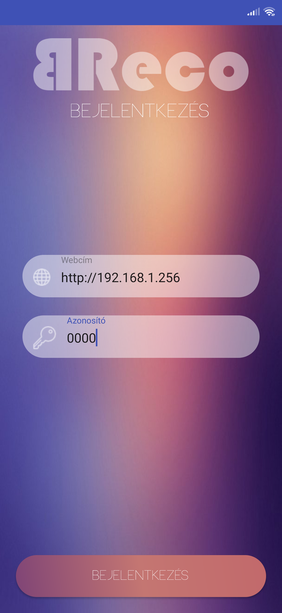
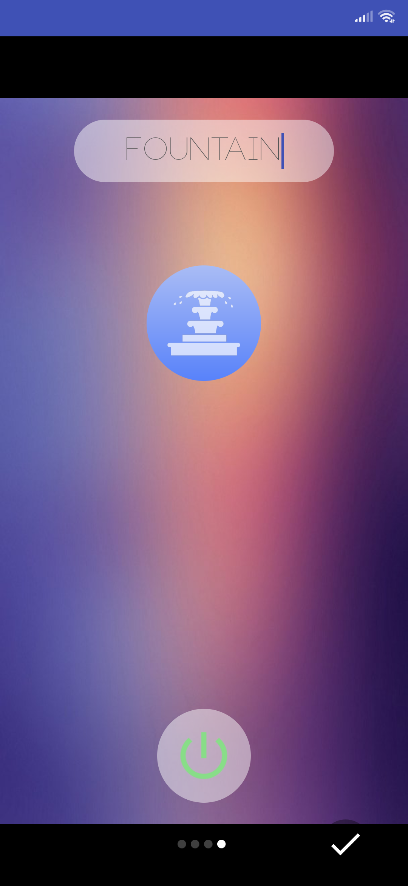
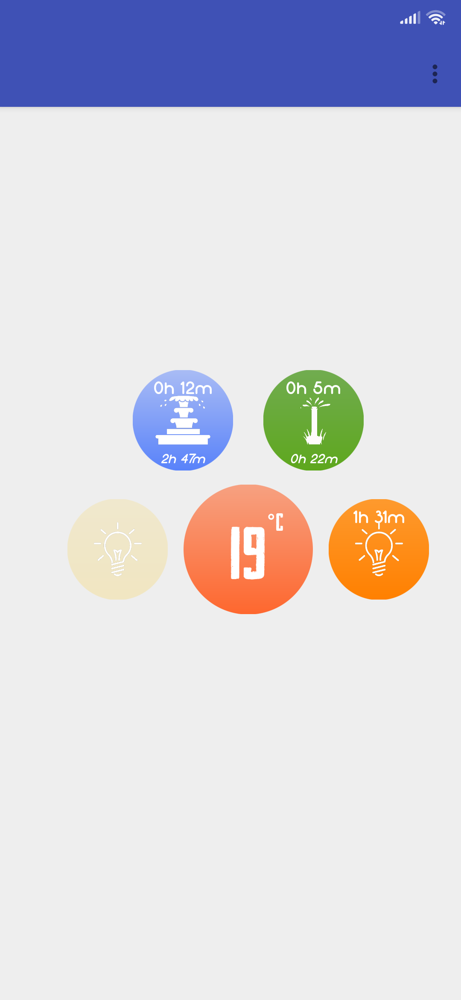
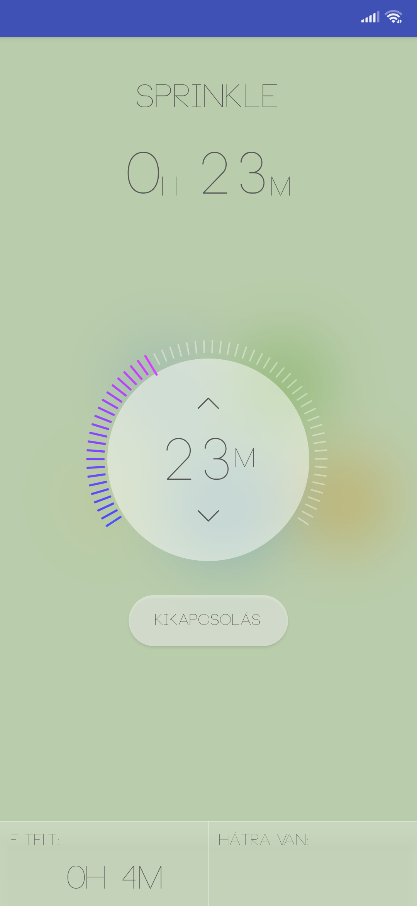

# SmartGarden

An **end-to-end** solution to control the devices (pump, lights, etc.) in our garden. It supports instant **control & timing**.

## Installation

Clone this repository and import into **Android Studio**
```bash
git clone git@github.com:stormset/SmartGarden.git
```

## Configuration

### Remarks

The configuration information is stored on the **ESP8266**. This currently only inclues the **device name** and it's **icon id**.
<br>The authentication code is also stored (hard-coded) on the **ESP8266**.

<br>

***My first android project. The code is quite monolithic, and should be breaked down.***

## Build variants

Use the Android Studio *Build Variants* button to choose between **production** and **staging** flavors combined with debug and release build types

## Screenshots


<br>



## Contributing

1. Fork it
2. Create your feature branch (git checkout -b my-new-feature)
3. Commit your changes (git commit -m 'Add some feature')
4. Push your branch (git push origin my-new-feature)
5. Create a new Pull Request
